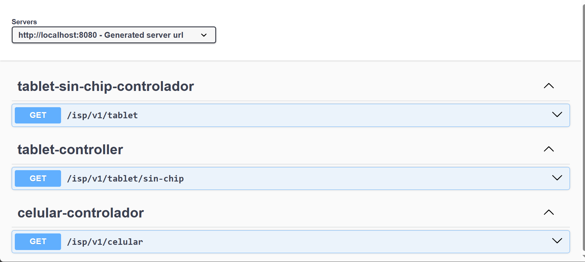

### Documentación del Proyecto SOLID con Enfoque en ISP (Interface Segregation Principle)

#### Descripción General
Este proyecto es una implementación de un sistema de dispositivos electrónicos siguiendo el Principio de Segregación de Interfaces (ISP) de SOLID. La aplicación está configurada para usar Spring Boot y Springdoc para la documentación de la API con Swagger.

La documentación de las APIs se puede visualizar en la siguiente URL:
```
http://localhost:8080/swagger-ui.html
```

## **Select Language:**
- [Español (Spanish)](README-es.md)
- [English](README.md)

## Result
### Swagger UI Documentation
 
### Result of Phone 

### Result of Tablet

### Result of Tablet Without Chip


#### Estructura de Paquetes
La estructura de paquetes es la siguiente:

- `top.anyel.solid.dispositivos.interfaces`: Contiene las interfaces que definen
#### Configuración de Spring Boot
El archivo de configuración `application.properties` está configurado para habilitar y definir la ruta de Swagger UI:

```properties
spring.application.name=SOLID

springdoc.api-docs.enabled=true
springdoc.swagger-ui.enabled=true

# Definir la ruta de swagger-ui
springdoc.swagger-ui.path=/swagger-ui.html
```

#### Estructura de Paquetes
La estructura de paquetes es la siguiente:

- `top.anyel.solid.dispositivos.interfaces`: Contiene las interfaces que definen los comportamientos de los dispositivos.
- `top.anyel.solid.dispositivos.implementacion`: Contiene las clases que implementan las interfaces.
- `top.anyel.solid.dispositivos.controlador`: Contiene los controladores REST que exponen los endpoints de la API.

#### Interfaces

##### Dispositivo
Interfaz genérica inicial (NO RECOMENDADA):

```java
package top.anyel.solid.dispositivos.interfaces;

public interface Dispositivo {
    String hacerLlamada(String numero);
    String recibirLlamada(String numero);
    String encender();
    String apagar();
    String mostrarInformacion();
}
```

##### DispositivoConLlamadas
Interfaz específica para dispositivos con capacidad de llamadas:

```java
package top.anyel.solid.dispositivos.interfaces;

public interface DispositivoConLlamadas {
    String hacerLlamada(String numero);
    String recibirLlamada(String numero);
}
```

##### DispositivoElectronicoBasico
Interfaz específica para funciones básicas de dispositivos electrónicos:

```java
package top.anyel.solid.dispositivos.interfaces;

public interface DispositivoElectronicoBasico {
    String encender();
    String apagar();
    String mostrarInformacion();
}
```

#### Implementaciones

##### Tablet (Implementación Incorrecta)
Implementa la interfaz genérica `Dispositivo`, pero no todas las funcionalidades son aplicables:

```java
package top.anyel.solid.dispositivos.implementacion;

import top.anyel.solid.dispositivos.interfaces.Dispositivo;

public class Tablet implements Dispositivo {
    @Override
    public String hacerLlamada(String numero) {
        return null; // Método no implementado
    }

    @Override
    public String recibirLlamada(String numero) {
        return null; // Método no implementado
    }

    @Override
    public String encender() {
        return "encendido";
    }

    @Override
    public String apagar() {
        return "apagado";
    }

    @Override
    public String mostrarInformacion() {
        return "Mostrando información";
    }
}
```

##### TabletSinChip (Implementación Correcta)
Implementa solo `DispositivoElectronicoBasico`:

```java
package top.anyel.solid.dispositivos.implementacion;

import top.anyel.solid.dispositivos.interfaces.DispositivoElectronicoBasico;

public class TabletSinChip implements DispositivoElectronicoBasico {
    @Override
    public String encender() {
        return "Tablet encendida";
    }

    @Override
    public String apagar() {
        return "Tablet apagada";
    }

    @Override
    public String mostrarInformacion() {
        return "Mostrando información";
    }
}
```

##### Celular (Implementación Correcta)
Implementa tanto `DispositivoConLlamadas` como `DispositivoElectronicoBasico`:

```java
package top.anyel.solid.dispositivos.implementacion;

import top.anyel.solid.dispositivos.interfaces.DispositivoConLlamadas;
import top.anyel.solid.dispositivos.interfaces.DispositivoElectronicoBasico;

public class Celular implements DispositivoElectronicoBasico, DispositivoConLlamadas {
    @Override
    public String encender() {
        return "Teléfono inteligente encendido";
    }

    @Override
    public String apagar() {
        return "Teléfono inteligente apagado";
    }

    @Override
    public String hacerLlamada(String numero) {
        return "Llamando al número: " + numero;
    }

    @Override
    public String recibirLlamada(String numero) {
        return "Recibiendo llamada del número: " + numero;
    }

    @Override
    public String mostrarInformacion() {
        return "Mostrando información";
    }
}
```

#### Controladores

##### CelularControlador
Exposición de la funcionalidad del celular a través de un endpoint REST:

```java
package top.anyel.solid.dispositivos.controlador;

import org.springframework.web.bind.annotation.GetMapping;
import org.springframework.web.bind.annotation.RequestMapping;
import org.springframework.web.bind.annotation.RestController;
import top.anyel.solid.dispositivos.implementacion.Celular;

@RestController
@RequestMapping("/isp/v1")
public class CelularControlador {

    @GetMapping("/celular")
    public String celular() {
        Celular celular = new Celular();
        return celular.encender() + "\n" +
               celular.apagar() + "\n" +
               celular.mostrarInformacion() + "\n" +
               celular.hacerLlamada("123456789") + "\n" +
               celular.recibirLlamada("123456789");
    }
}
```

##### TabletController (Implementación Incorrecta)
Expone métodos no implementados adecuadamente:

```java
package top.anyel.solid.dispositivos.controlador;

import org.springframework.web.bind.annotation.GetMapping;
import org.springframework.web.bind.annotation.RequestMapping;
import org.springframework.web.bind.annotation.RestController;
import top.anyel.solid.dispositivos.implementacion.Tablet;

@RestController
@RequestMapping("/isp/v1")
public class TabletController {

    @GetMapping("/tablet/sin-chip")
    public String tabletSinChip() {
        Tablet tablet = new Tablet();
        return tablet.encender() + "\n" +
               tablet.apagar() + "\n" +
               tablet.mostrarInformacion() + "\n" +
               tablet.hacerLlamada("123456789") + "\n" + // Método no implementado
               tablet.recibirLlamada("123456789"); // Método no implementado
    }
}
```

##### TabletSinChipControlador
Exposición de la funcionalidad de `TabletSinChip` a través de un endpoint REST:

```java
package top.anyel.solid.dispositivos.controlador;

import org.springframework.web.bind.annotation.GetMapping;
import org.springframework.web.bind.annotation.RequestMapping;
import org.springframework.web.bind.annotation.RestController;
import top.anyel.solid.dispositivos.implementacion.TabletSinChip;

@RestController
@RequestMapping("/isp/v1")
public class TabletSinChipControlador {

    @GetMapping("/tablet")
    public String tabletSinChip() {
        TabletSinChip tablet = new TabletSinChip();
        return tablet.encender() + "\n" +
               tablet.apagar() + "\n" +
               tablet.mostrarInformacion();
    }
}
```

### Conclusión
El proyecto sigue el principio de segregación de interfaces, asegurando que cada clase implemente solo las interfaces necesarias. Esto se refleja en las implementaciones de `TabletSinChip` y `Celular`, que son correctas y específicas para sus funcionalidades, en contraste con la implementación incorrecta de `Tablet` que intenta implementar una interfaz genérica inapropiada. La configuración de Spring Boot permite la documentación de la API a través de Swagger UI para una fácil visualización y prueba de los endpoints REST.