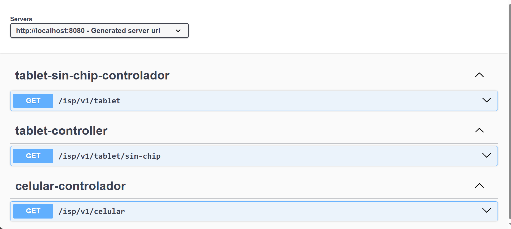
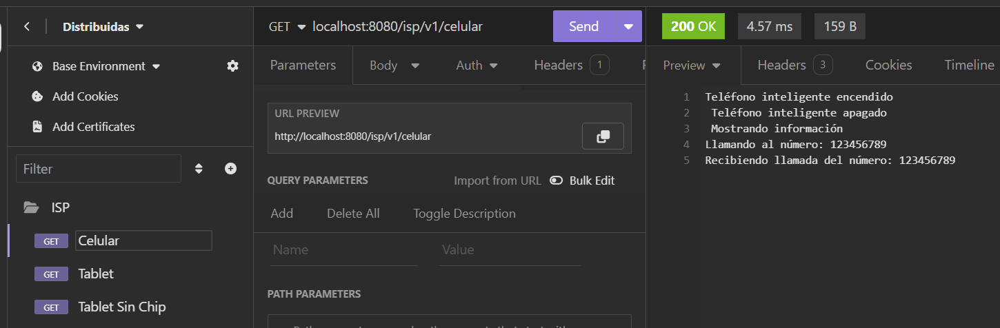
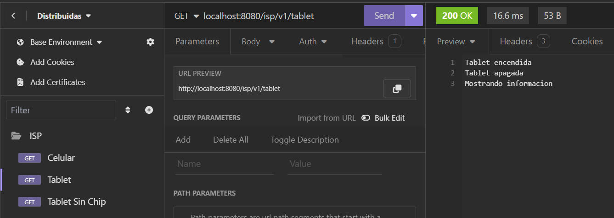
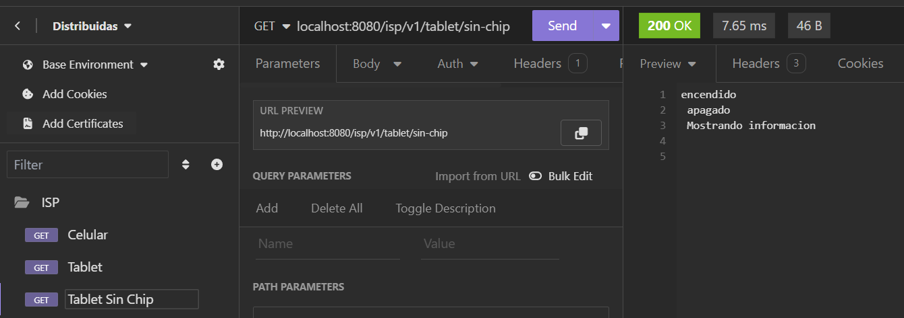

### Project Documentation: SOLID with a Focus on ISP (Interface Segregation Principle)

#### General Description
This project is an implementation of an electronic devices system following the Interface Segregation Principle (ISP) of SOLID. The application is configured to use Spring Boot and Springdoc for API documentation with Swagger.

## **Select Language:**
- [Español (Spanish)](README-es.md)
- [English](README.md)

The API documentation can be viewed at the following URL:
```
http://localhost:8080/swagger-ui.html
```


## Result
### Swagger UI Documentation

### Result of Phone

### Result of Tablet

### Result of Tablet Without Chip



#### Spring Boot Configuration
The `application.properties` configuration file is set up to enable and define the path for Swagger UI:

```properties
spring.application.name=SOLID

springdoc.api-docs.enabled=true
springdoc.swagger-ui.enabled=true

# Define the path for swagger-ui
springdoc.swagger-ui.path=/swagger-ui.html
```

#### Package Structure
The package structure is as follows:

- `top.anyel.solid.dispositivos.interfaces`: Contains the interfaces that define the behaviors of the devices.
- `top.anyel.solid.dispositivos.implementacion`: Contains the classes that implement the interfaces.
- `top.anyel.solid.dispositivos.controlador`: Contains the REST controllers that expose the API endpoints.

#### Interfaces

##### Dispositivo
Generic initial interface (NOT RECOMMENDED):

```java
package top.anyel.solid.dispositivos.interfaces;

public interface Dispositivo {
    String hacerLlamada(String numero);
    String recibirLlamada(String numero);
    String encender();
    String apagar();
    String mostrarInformacion();
}
```

##### DispositivoConLlamadas
Specific interface for devices with call capabilities:

```java
package top.anyel.solid.dispositivos.interfaces;

public interface DispositivoConLlamadas {
    String hacerLlamada(String numero);
    String recibirLlamada(String numero);
}
```

##### DispositivoElectronicoBasico
Specific interface for basic electronic device functions:

```java
package top.anyel.solid.dispositivos.interfaces;

public interface DispositivoElectronicoBasico {
    String encender();
    String apagar();
    String mostrarInformacion();
}
```

#### Implementations

##### Tablet (Incorrect Implementation)
Implements the generic `Dispositivo` interface, but not all functionalities are applicable:

```java
package top.anyel.solid.dispositivos.implementacion;

import top.anyel.solid.dispositivos.interfaces.Dispositivo;

public class Tablet implements Dispositivo {
    @Override
    public String hacerLlamada(String numero) {
        return null; // Method not implemented
    }

    @Override
    public String recibirLlamada(String numero) {
        return null; // Method not implemented
    }

    @Override
    public String encender() {
        return "encendido";
    }

    @Override
    public String apagar() {
        return "apagado";
    }

    @Override
    public String mostrarInformacion() {
        return "Mostrando información";
    }
}
```

##### TabletSinChip (Correct Implementation)
Implements only `DispositivoElectronicoBasico`:

```java
package top.anyel.solid.dispositivos.implementacion;

import top.anyel.solid.dispositivos.interfaces.DispositivoElectronicoBasico;

public class TabletSinChip implements DispositivoElectronicoBasico {
    @Override
    public String encender() {
        return "Tablet encendida";
    }

    @Override
    public String apagar() {
        return "Tablet apagada";
    }

    @Override
    public String mostrarInformacion() {
        return "Mostrando información";
    }
}
```

##### Celular (Correct Implementation)
Implements both `DispositivoConLlamadas` and `DispositivoElectronicoBasico`:

```java
package top.anyel.solid.dispositivos.implementacion;

import top.anyel.solid.dispositivos.interfaces.DispositivoConLlamadas;
import top.anyel.solid.dispositivos.interfaces.DispositivoElectronicoBasico;

public class Celular implements DispositivoElectronicoBasico, DispositivoConLlamadas {
    @Override
    public String encender() {
        return "Teléfono inteligente encendido";
    }

    @Override
    public String apagar() {
        return "Teléfono inteligente apagado";
    }

    @Override
    public String hacerLlamada(String numero) {
        return "Llamando al número: " + numero;
    }

    @Override
    public String recibirLlamada(String numero) {
        return "Recibiendo llamada del número: " + numero;
    }

    @Override
    public String mostrarInformacion() {
        return "Mostrando información";
    }
}
```

#### Controllers

##### CelularController
Exposes the functionality of the cell phone through a REST endpoint:

```java
package top.anyel.solid.dispositivos.controlador;

import org.springframework.web.bind.annotation.GetMapping;
import org.springframework.web.bind.annotation.RequestMapping;
import org.springframework.web.bind.annotation.RestController;
import top.anyel.solid.dispositivos.implementacion.Celular;

@RestController
@RequestMapping("/isp/v1")
public class CelularControlador {

    @GetMapping("/celular")
    public String celular() {
        Celular celular = new Celular();
        return celular.encender() + "\n" +
               celular.apagar() + "\n" +
               celular.mostrarInformacion() + "\n" +
               celular.hacerLlamada("123456789") + "\n" +
               celular.recibirLlamada("123456789");
    }
}
```

##### TabletController (Incorrect Implementation)
Exposes methods that are not properly implemented:

```java
package top.anyel.solid.dispositivos.controlador;

import org.springframework.web.bind.annotation.GetMapping;
import org.springframework.web.bind.annotation.RequestMapping;
import org.springframework.web.bind.annotation.RestController;
import top.anyel.solid.dispositivos.implementacion.Tablet;

@RestController
@RequestMapping("/isp/v1")
public class TabletController {

    @GetMapping("/tablet/sin-chip")
    public String tabletSinChip() {
        Tablet tablet = new Tablet();
        return tablet.encender() + "\n" +
               tablet.apagar() + "\n" +
               tablet.mostrarInformacion() + "\n" +
               tablet.hacerLlamada("123456789") + "\n" + // Method not implemented
               tablet.recibirLlamada("123456789"); // Method not implemented
    }
}
```

##### TabletSinChipController
Exposes the functionality of `TabletSinChip` through a REST endpoint:

```java
package top.anyel.solid.dispositivos.controlador;

import org.springframework.web.bind.annotation.GetMapping;
import org.springframework.web.bind.annotation.RequestMapping;
import org.springframework.web.bind.annotation.RestController;
import top.anyel.solid.dispositivos.implementacion.TabletSinChip;

@RestController
@RequestMapping("/isp/v1")
public class TabletSinChipControlador {

    @GetMapping("/tablet")
    public String tabletSinChip() {
        TabletSinChip tablet = new TabletSinChip();
        return tablet.encender() + "\n" +
               tablet.apagar() + "\n" +
               tablet.mostrarInformacion();
    }
}
```

### Conclusion
The project adheres to the Interface Segregation Principle, ensuring that each class implements only the necessary interfaces. This is reflected in the correct implementations of `TabletSinChip` and `Celular`, which are specific to their functionalities, in contrast to the incorrect implementation of `Tablet` that attempts to implement an inappropriate generic interface. The Spring Boot configuration allows API documentation through Swagger UI for easy visualization and testing of the REST endpoints.